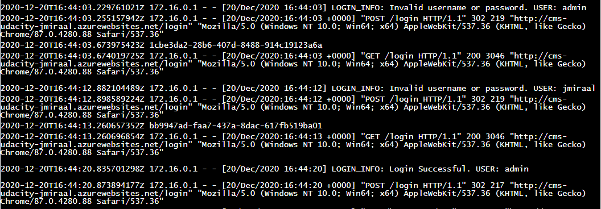

# Article CMS (FlaskWebProject)

This project is a Python web application built using Flask. The user can log in and out and create/edit articles. An article consists of a title, author, and body of text stored in an Azure SQL Server along with an image that is stored in Azure Blob Storage. You will also implement OAuth2 with Sign in with Microsoft using the `msal` library, along with app logging.

## Log In Credentials for FlaskWebProject

- Username: admin
- Password: pass

Or, once the MS Login button is implemented, it will automatically log into the `admin` account.

## Project Instructions (For Student)

You are expected to do the following to complete this project:
1. Create a Resource Group in Azure.

**Resource Group created**
2. Create an SQL Database in Azure that contains a user table, an article table, and data in each table (populated with the scripts provided in the SQL Scripts folder).
    - Provide a screenshot of the populated tables as detailed further below.
	
	**This is the screenshot that we have obtained:**
	
3. Create a Storage Container in Azure for `images` to be stored in a container.
    - Provide a screenshot of the storage endpoint URL as detailed further below.
	
    **These are the properties of the Blob Storage Account we have created:**
	
4. Add functionality to the Sign In With Microsoft button. 
    - This will require completing TODOs in `views.py` with the `msal` library, along with appropriate registration in Azure Active Directory.
	
    **We have added TODO code in `views.py`:**
	
5. Choose to use either a VM or App Service to deploy the FlaskWebProject to Azure. Complete the analysis template in `WRITEUP.md` (or include in the README) to compare the two options, as well as detail your reasoning behind choosing one or the other. Once you have made your choice, go through with deployment.

**We have opted by deploying an App Service instead of a Virtul Machine due to the next reasons:** 
* **The project is very simple and the App Service option is the easiest and cheaper way of implementing an app.**
* **We don't need many of the advantages of a Virtual Machine, since it is unnecessary to control the OS, the app is developed in Python, which is perfectly suported by the App Service, and we don't need to install any additional software. We don't need also to migrate any existing service from an local image.**
* **The nature of the app fits perfectly in the use cases that the App Service was designed for. It is a light weight web app. Besides that, a Virtual Machine can be switched down when it is not used, but this service is expected to be running all the time, so this possible advantage makes no sense in our case.**
* **We don't have information about the theoretical use of the app. If it is thinked for beeing used inside an organization, a company or a school, the number of possible users will be limited and the resource requirements will not probably exceed the limit of the Service.**
* **We can monitorize the use of the application and the resources consumed. We have a wide margin to increment its capacity. The app is quite light and it doesnt't use many CPU, but if we store a lot of posts, we could need more than the maximum 14Gb available. This can occur also if we make a change allowing the users to add many photos per post. We could implement a modification to limit the size of each photo also.**
* **Anyway, when we were close to the limit of maximum capacity for the App Service, it wouldn't be difficult to migrate to a Virtual Machine.**
	
6. Add logging for whether users successfully or unsuccessfully logged in.
    - This will require completing TODOs in `__init__.py`, as well as adding logging where desired in `views.py`.
	
        **We have configured de Flask Logger to show warnings and avobe events. We have also defined a stream handler and we have added it to the logger:**
        
        **Then we have added some logs to show login results in the `views.py` file. These are the logs added in the `login` function:**
	    
        **We have also added some logs in the `authorized` function:**
	    
7. To prove that the application in on Azure and working, go to the URL of your deployed app, log in using the credentials in this README, click the Create button, and create an article with the following data:
	- Title: "Hello World!"
	- Author: "Jane Doe"
	- Body: "My name is Jane Doe and this is my first article!"
	- Upload an image of your choice. Must be either a .png or .jpg.
   After saving, click back on the article you created and provide a screenshot proving that it was created successfully. Please also make sure the URL is present in the screenshot.
8. Log into the Azure Portal, go to your Resource Group, and provide a screenshot including all of the resources that were created to complete this project. (see sample screenshot in "example_images" folder)

**We have added a post and this is the its screenshot:**
	
9. Take a screenshot of the Redirect URIs entered for your registered app, related to the MS Login button.

**This is the screenshot of the redirect URIs:**
	
10. Take a screenshot of your logs (can be from the Log stream in Azure) showing logging from an attempt to sign in with an invalid login, as well as a valid login.

**We can see two invalid log attempts and one successful login:**
	
    
**In this other log we can see a successful login with `msal`:**
	
    
## Additional Suggestions
1. Modify both the Python Application and SQL Database to include a Subtitle field. The field should be displayed below the Title field in the screenshot, and deployed with the app.

**As we can see in the image of the post above, this field was also added in the table `POSTS` and in the app:**
2. The current application does not allow for the deletion of a created article, or complete removal of an image after one is added (it can only be replaced). Add this functionality to the application.

**We have added an option in the main page called `Delete Post`, beside `Edit Post`, with which we can delete completely the post selected. This option deletes also the image from the Blob Container.**
	
    
**It was added also a checkbox in the Edit page called `Delete Image`. It is only showed in the `Edit Post` screen and when the post has a picture. If we select this option and we click save, the image will be deleted from the post and from the Blob Storage Account.**
	
3. The current application just uses the admin account if the user signs in with Microsoft. Adjust the app to better track which user is logged in.

**I am not sure of what is spected to do in this point but, as we have seen in the logging screenshots, we register also those logins authorized from a Microsoft account with the user used to log in.**

## example_images Folder

This folder contains sample screenshots that students are required to submit in order to prove they completed various tasks throughout the project.

1. article-cms-solution.png is a screenshot from running the FlaskWebProject on Azure and prove that the student was able to create a new entry. The Title, Author, and Body fields must be populated to prove that the data is being retrieved from the Azure SQL Database while the image on the right proves that an image was uploaded and pulled from Azure Blob Storage.
2. azure-portal-resource-group.png is a screenshot from the Azure Portal showing all of the contents of the Resource Group the student needs to create. The resource group must (at least) contain the following:
	- Storage Account
	- SQL Server
	- SQL Database
	- Resources related to deploying the app
3. sql-storage-solution.png is a screenshot showing the created tables and one query of data from the initial scripts.
4. blob-solution.png is a screenshot showing an example of blob endpoints for where images are sent for storage.
5. uri-redirects-solution.png is a screenshot of the redirect URIs related to Microsoft authentication.
6. log-solution.png is a screenshot showing one potential form of logging with an "Invalid login attempt" and "admin logged in successfully", taken from the app's Log stream. You can customize your log messages as you see fit for these situations.

## Dependencies

1. A free Azure account
2. A GitHub account
3. Python 3.7 or later
4. Visual Studio 2019 Community Edition (Free)
5. The latest Azure CLI (helpful; not required - all actions can be done in the portal)

All Python dependencies are stored in the requirements.txt file. To install them, using Visual Studio 2019 Community Edition:
1. In the Solution Explorer, expand "Python Environments"
2. Right click on "Python 3.7 (64-bit) (global default)" and select "Install from requirements.txt"

## Troubleshooting

- Mac users may need to install `unixodbc` as well as related drivers as shown below:
    ```bash
    brew install unixodbc
    ```
- Check [here](https://docs.microsoft.com/en-us/sql/connect/odbc/linux-mac/install-microsoft-odbc-driver-sql-server-macos?view=sql-server-ver15) to add SQL Server drivers for Mac.